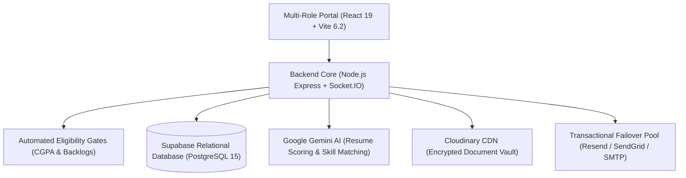
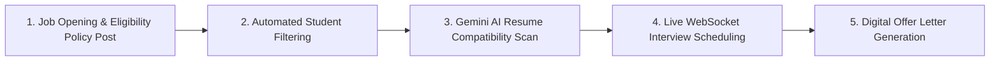

# 🎓 CampusConnect — Automated Campus Placement & Corporate Recruitment Ecosystem
### *Enterprise Placement Governance with Bi-Directional WebSockets, Gemini AI Resume Screening & Multi-Channel Pipelines*

    [-3ECF8E?style=for-the-badge&logo=supabase&logoColor=white)](#)  

  <a href="https://github.com/Tharun4743/CampusConnect">📦 <b>Official GitHub Repository</b></a>
  • <a href="https://campusconnect-yg4h.onrender.com">🌐 <b>Production Live Demo</b></a>
  

---

## 1. 📌 Problem Statement & Context
During collegiate campus recruitment drives, coordination between students, TPOs, and corporate recruiters faces severe friction:

* 📑 **Manual Eligibility Auditing:** TPOs spend days auditing eligibility (CGPA cutoffs, backlogs) across error-prone spreadsheets.
* ⏳ **Opaque Candidate Pipelines:** Students lack real-time visibility into their journey, querying coordinators about shortlist announcements.
* 📂 **Disorganized Resume Archives:** Candidates upload unverified CVs in disparate formats, leading to broken links during HR reviews.
* 📢 **Severe Communication Lag:** Interview scheduling adjustments sent via unindexed messaging groups cause missed evaluation rounds.

---

## 2. 🔍 Existing Solutions & Critical Gaps
| Feature / Metric | Commercial Job Portals (Naukri / LinkedIn) | Traditional Spreadsheets & Email | 🎓 CampusConnect |
| :--- | :---: | :---: | :---: |
| **College Role Separation** | ❌ Student/Recruiter Only | ❌ None | ✅ 4 Distinct Roles (Student, TPO, HR, Admin) |
| **Automated Backlog / CGPA Gates** | ❌ Unverified Self-Reported | ⚠️ Manual Formula Auditing | ✅ Strict Database Guardrails |
| **Real-Time WebSocket Pipeline** | ❌ Page Refresh Required | ❌ None | ✅ Live Bi-Directional Socket.IO Updates |
| **AI Resume Evaluation** | ⚠️ Generic Keyword Scoring | ❌ None | ✅ Google Gemini AI Skill-Gap Analysis |
| **Transactional Email Failover** | ⚠️ Single Provider | ❌ Manual Gmail Sends | ✅ Resend / SendGrid / SMTP Triple Failover |

### ⚠️ Critical Limitations of Existing Alternatives:
* 🚫 **Unverified Self-Reporting:** Commercial portals rely on unchecked user claims, forcing TPOs to re-verify candidates by hand.
* 🛑 **Spreadsheet Data Corruption:** Shared spreadsheets frequently suffer from formula errors, accidental row deletions, and leaks.
* 📴 **Missed Interview Windows:** Without live push alerts and automated notifications, students miss critical interview time slots.

---

## 3. 💡 Proposed Solution & Architectural Innovation
**CampusConnect** is a campus recruitment and placement governance platform unifying Students, TPOs, Recruiters, and Admins:

* 📂 **Verified Cloud Document Vault:** Secure repository hosting academic transcripts, verified resumes, and certifications.
* 🤖 **Google Gemini AI Resume Intelligence:** Semantic analysis matching resumes against jobs, computing fit scores and skill gaps.
* ⚡ **Live WebSocket Funnel:** Bi-directional Socket.IO updates: Applied → Shortlisted → Interviewing → Offered.
* 💼 **Corporate Recruiter Drive Suite:** HR teams publish openings with strict CGPA and backlog gates, filter candidate pools, and dispatch offers.
* 🛡️ **Hardened Enterprise Security:** Defense-in-depth architecture with HttpOnly JWT tokens, CSRF validation, and rate limiting.

---

## 4. ⚙️ Technical Approach & System Architecture

### 📐 High-Level Architectural Flowchart:

```mermaid
graph TD
    Portal["Multi-Role Portal (React 19 + Vite 6.2)"] --> Server["Backend Core (Node.js Express + Socket.IO)"]
    Server --> Gate["Automated Eligibility Gates (CGPA & Backlogs)"]
    Server --> DB[("Supabase Relational Database (PostgreSQL 15)")]
    Server --> AI["Google Gemini AI (Resume Scoring & Skill Matching)"]
    Server --> Media["Cloudinary CDN (Encrypted Document Vault)"]
    Server --> Email["Transactional Failover Pool (Resend / SendGrid / SMTP)"]
```

| System Tier | Technology Stack | Operational Functionality |
| :--- | :--- | :--- |
| **Client Portal** | React 19, Vite 6.2, Tailwind CSS v4 | Responsive interface with Framer Motion animations and reactive state |
| **Backend Core** | Node.js 20+, Express, Socket.IO | High-concurrency REST endpoints and bi-directional WebSocket event relays |
| **Database & Media** | Supabase (PostgreSQL 15), Cloudinary | Relational schema with foreign key integrity; secure cloud CDN for resumes |
| **AI & Messaging** | Google Gemini AI, Resend, Nodemailer | Automated resume evaluation; multi-node failover transactional emails |
| **Security Layer** | JWT (HttpOnly), Helmet, Rate Limiting | Domain verification, proxy-aware abuse prevention, and CSRF protection |

### 🔄 End-to-End Operational Lifecycle Workflow:

```mermaid
flowchart LR
    A["1. Job Opening & Eligibility Policy Post"] --> B["2. Automated Student Filtering"]
    B --> C["3. Gemini AI Resume Compatibility Scan"]
    C --> D["4. Live WebSocket Interview Scheduling"]
    D --> E["5. Digital Offer Letter Generation"]
```

1. **Job Drive Inception:** Recruiter posts opening with strict CGPA and backlog criteria → Database auto-filters eligible students.
2. **AI Screening & TPO Sign-off:** Students apply with one click → Gemini AI computes fit score → TPO reviews and approves candidate pool.
3. **Live Interview Management:** Recruiter sends interview invitations → Students receive WebSocket alerts and email updates in real time.

---

## 5. 📈 Quantifiable Impact & Measurable Benefits
* ⏱️ **70% Less Coordination Overhead:** Automated eligibility filtering saves TPOs dozens of hours per campus drive.
* 🚀 **Zero Communication Lag:** Live WebSockets ensure 100% of shortlisted candidates receive interview updates instantly.
* 🔍 **Sub-Second Candidate Screening:** Corporate recruiters filter hundreds of profiles by exact criteria in milliseconds.
* ☁️ **Turnkey Continuous Deployment:** Pre-configured with render.yaml infrastructure-as-code for zero-downtime deployment.

---

## 6. 🚀 Feasibility, Operational Viability & Scalability
* 🔬 **Technical Feasibility:** Operating in production on Render with cloud PostgreSQL, reliably handling heavy traffic bursts during placement drives.
* 💰 **Economic & Financial Viability:** Replaces third-party commercial placement software costing thousands of dollars annually with open-source infrastructure.
* 🏛️ **Operational Governance:** Multi-persona access control maps directly to existing academic placement hierarchies and administrative workflows.
* 📈 **Horizontal Scalability Roadmap:** Easily extensible to support inter-collegiate placement consortia, multi-campus university networks, and alumni programs.

---

## 7. 👨‍💻 Author & Intellectual Property License

### Lead Architect & Author
**Tharunkumar K** ([@Tharun4743](https://github.com/Tharun4743))
* 🎓 B.Tech Information Technology • V.S.B. Engineering College, Karur
* 🌐 [GitHub Profile](https://github.com/Tharun4743) • [LinkedIn](https://linkedin.com/in/tharunkumark4743) • [Personal Portfolio](https://tharunkumark4743.netlify.app)

### 🔒 Proprietary License Notice (All Rights Reserved)
> [!CAUTION]
> **PROPRIETARY & CONFIDENTIAL INTELLECTUAL PROPERTY**
> 
> All rights reserved. This repository, its architecture, source code, workflows, firmware, and associated documentation are the exclusive intellectual property of **Tharunkumar K**.
> 
> **No entity, organization, or individual is permitted to copy, modify, distribute, publish, commercially exploit, reverse engineer, or deploy any portion of this project without express, prior written permission from the author.**
> 
> **Copyright © 2026 Tharunkumar K. All Rights Reserved.**
